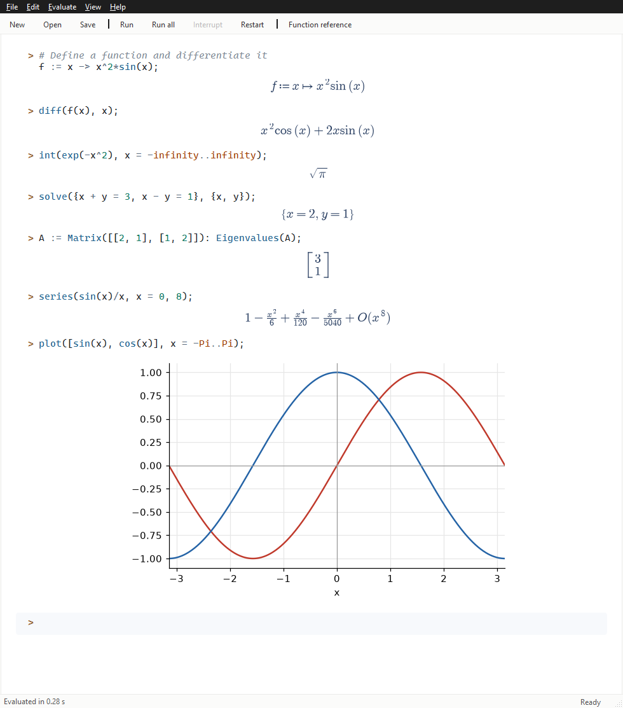

# Symple

A minimal, worksheet-style desktop front-end for [SymPy](https://www.sympy.org)
with a **Maple-inspired input language**.

Type a command at the `>` prompt, press **Enter**, and the typeset result appears
directly underneath, just like a classic computer-algebra worksheet.



## Features

- **Worksheet interface**: editable input cells with the output rendered below each one.
  You can re-run any cell at any time, and worksheets save to `.syw` files.
- **Typeset output**: fractions, roots, integrals, series, matrices and piecewise
  functions are rendered as math. Right-click an output to copy it as text or LaTeX.
- **Maple-inspired syntax**: `:=` assignment, `->` arrow functions, `a..b` ranges,
  `;` to show / `:` to hide output, `%` for the previous result, `proc … end proc`,
  `if … then … end if`, `for … do … end do`, `'x'` delayed evaluation and more.
- **Syntax highlighting** of keywords, built-ins, constants, numbers, strings and comments,
  plus matching-bracket highlighting.
- **Structural diagnostics while you type**: unbalanced brackets, unclosed `if`/`do`/`proc`
  blocks, missing terminators, wrong argument counts, typos in function names
  (`Sin` → did you mean `sin`?), `=` vs `:=`, `break` outside a loop, and more.
  Problems are underlined; hover to see the message.
- **Autocompletion** of built-ins, keywords and your own variables, with signatures
  (triggered automatically or with **Ctrl+Space**).
- **Inline plots** with `plot` and `plot3d`.
- **Export to PDF** (**File → Export as PDF…**, Ctrl+P): typeset input, results and plots, paginated for printing or sharing.
- **Safe evaluation**: input is parsed by Symple's own parser and mapped onto an
  allow-list of SymPy functions. It is never passed to Python's `eval`.
- **Interruptible**: computations run in a separate process and can be stopped at any time.

## Install & run

Requires Python 3.10 or newer.

```bash
git clone https://github.com/alestoman5/symple.git
cd symple
python -m venv .venv
# Windows: .venv\Scripts\activate      macOS/Linux: source .venv/bin/activate
pip install -e ".[dev]"
symple                      # or: python -m symple
symple examples/tour.syw    # open the example worksheet
```

Run the tests with `pytest`.

## A quick tour

```
> f := x -> x^2*sin(x):             # ':' hides the output
> diff(f(x), x);
                      x² cos(x) + 2 x sin(x)
> int(1/(1 + x^2), x = 0..1);
                               π/4
> solve({x + y = 3, x - y = 1}, {x, y});
                          {x = 2, y = 1}
> A := Matrix([[1, 2], [3, 4]]): Determinant(A), MatrixInverse(A);
> dsolve({diff(y(x), x, x) + y(x) = 0, y(0) = 1, D(y)(0) = 0}, y(x));
                           y(x) = cos(x)
> fact := proc(n) if n <= 1 then 1 else n*fact(n - 1) end if end proc:
> fact(20);
                        2432902008176640000
> evalf(Pi, 30);
> plot([sin(x), cos(x)], x = -Pi..Pi);
```

Press **F1** in the app for the full function reference.

| Key                | Action                                  |
|--------------------|-----------------------------------------|
| Enter              | Run the cell and move to the next one   |
| Shift+Enter        | New line inside the cell                |
| Ctrl+Space         | Show completions                        |
| Up / Down          | Move between cells                      |
| Ctrl+J / Ctrl+K    | Insert a cell below / above             |
| Ctrl+Shift+D       | Delete the cell                         |
| Ctrl+Shift+Return  | Run all cells                           |
| Ctrl+Break         | Interrupt (restarts the session)        |
| Ctrl+Shift+R       | Restart the session                     |
| Ctrl+= / Ctrl+-    | Zoom                                    |

## Differences from other systems

Symple implements a practical *subset* of a Maple-style language on top of SymPy.
Results come from SymPy, so they may look different from other systems
(e.g. integration constants are named `C1`, `C2`). Things that are not supported
(yet) include modules, tables with arbitrary keys, `assume`, type-checked parameters
(annotations are accepted but ignored), and most packages apart from the linear-algebra
functions. Interrupting a computation restarts the session.

## Project layout

```
src/symple/lang/     lexer, parser, AST, diagnostics (no GUI or SymPy dependency)
src/symple/engine/   evaluator, built-ins, printing, plotting, worker process
src/symple/ui/       PySide6 worksheet, editor, highlighter, completer, math rendering
src/symple/catalog.py  names, signatures and help text for every built-in
```

Contributions are welcome. Please run `pytest` before opening a pull request.

## License

Symple is released under the [MIT License](LICENSE). Its dependencies keep their
own licenses; see [THIRD_PARTY_NOTICES.md](THIRD_PARTY_NOTICES.md).

## Disclaimer

Symple is an independent open-source project. It is **not affiliated with,
sponsored by, or endorsed by Waterloo Maple Inc. (Maplesoft)**. Maple is a
trademark of Waterloo Maple Inc. The term is used only to describe the style of
the input language. All documentation and help text in Symple is original.
